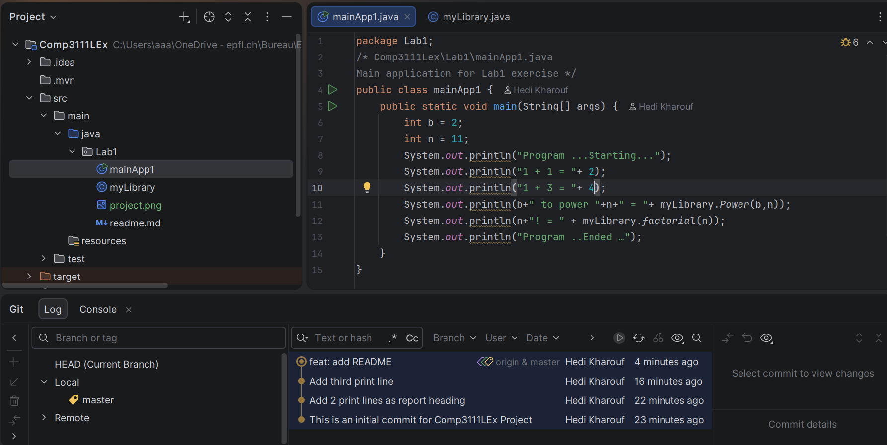

# Comp3111LEx, Lab 1: Introduction to Git & GitHub

## About This Project
A simple Java Maven project created for COMP3111 Software Engineering Lab 1.  
It demonstrates basic Git version control workflows using IntelliJ IDEA and GitHub.

## Project Structure
- `src/main/java/Lab1/myLibrary.java` – Library class with `power` and `factorial` methods
- `src/main/java/Lab1/mainApp1.java` – Main executable that calls the library
- `pom.xml` – Maven build configuration with JUnit Jupiter dependency

## Tech Stack
- Java 21
- Maven
- JUnit Jupiter 5.x
- IntelliJ IDEA Community Edition
- Git & GitHub

## IntelliJ Project Screenshot

<!-- Replace the path below with your actual image filename after uploading it to the repo -->

> The screenshot above shows the Project tool window (with `.idea` and `src` trees expanded),  
> the `myLibrary.java` editor, and the Git Log with at least three commits.